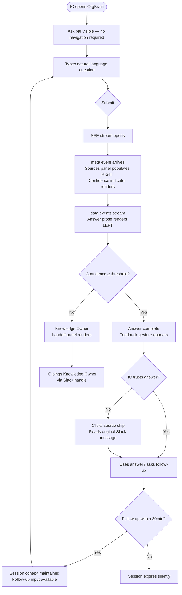
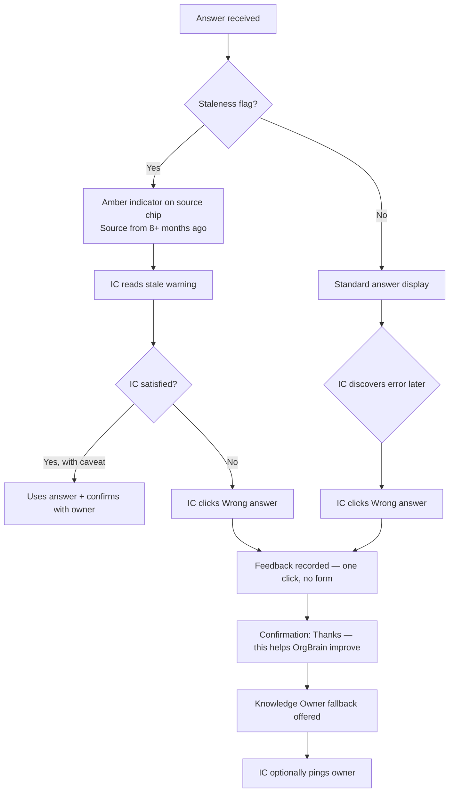
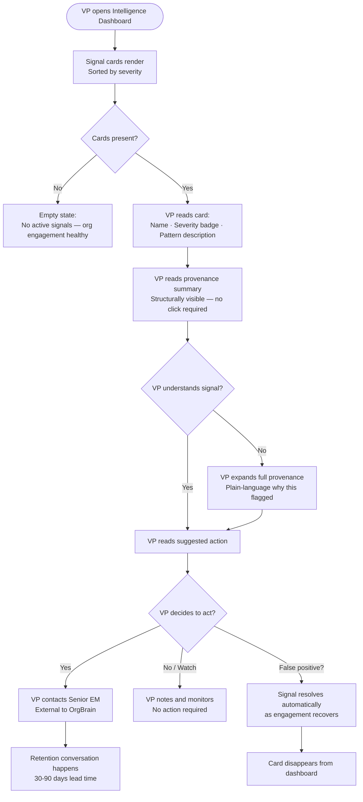
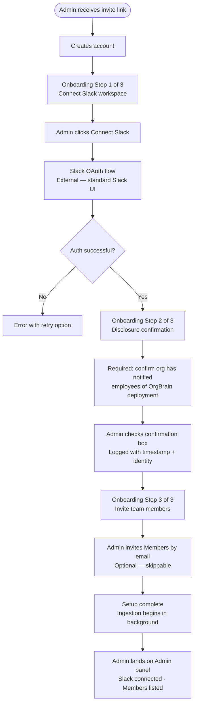

# UX Design Specification OrgBrain

**Author:** fouad
**Date:** 2026-05-28

---

<!-- UX design content will be appended sequentially through collaborative workflow steps -->

## Executive Summary

### Project Vision

OrgBrain is an AI-powered organizational memory system that passively ingests Slack communications, builds a structured Knowledge Graph, and surfaces two primary value streams: (1) sourced, confidence-scored answers to natural-language questions for any employee, and (2) departure risk signals for leadership based on engagement pattern analysis — all without requiring anyone to deliberately document anything.

Phase 1 (MVP) delivers Slack-only ingestion, a web UI query interface with source attribution and confidence scoring, and a single departure risk signal (Slack engagement velocity) on an Intelligence Dashboard.

### Target Users

| Persona | Phase 1 Value | Core UX Need |
|---|---|---|
| **IC / New Hire** | Get unblocked without interrupting a colleague | Trust: answers must feel sourced and honest, not magical |
| **VP of Engineering** | See who's disengaging before they resign | Clarity: plain-language signals with an obvious next action |
| **Admin** | Connect Slack, manage members, control privacy | Simplicity: one-time setup + rare but critical config tasks |

### Key Design Challenges

1. **Trust architecture, not trust perception.** ICs won't use OrgBrain if they think it hallucinates — but more critically, they will feel *betrayed* if they discover retroactively that their Slack activity was being monitored and scored. The consent/disclosure surface is a first-class UX problem, not a legal checkbox or onboarding footnote.

2. **The cold start experience.** The Knowledge Graph is sparse on day one. New hires — the users who need OrgBrain most — will encounter empty states and low-confidence answers first. What the product says when it *doesn't know* defines its character more than what it says when it does.

3. **Recovery rituals for wrong answers.** Confident wrong answers are the modal experience in the first 90 days of any deployment. There must be a designed recovery path: how does an IC report a bad answer, and how does that feedback propagate? Without this, the product has trust theater, not a trust system.

4. **Two radically different users, one product.** IC and VP have almost nothing in common in context, needs, or mental models. The IC interface must feel *complete* — not like a restricted version of something. The VP dashboard must never feel designed for an engineer.

5. **VP signal provenance.** When the Intelligence Dashboard flags someone, the VP needs a plain-language "why" — not raw data, but an auditable explanation. A wrong call about a person is career-ending for whoever acted on it. Without provenance, the Intelligence Tier is a liability.

### Design Opportunities

1. **Source attribution as a trust-building differentiator.** No competitor shows answer provenance with human-legible authority. Attribution that names the person ("Rafael, Staff Eng, said this in a March design review") lands differently than a channel + timestamp. The design decision — people vs. artifacts — determines the data model, not just the visual treatment.

2. **The Knowledge Owner fallback as intelligent routing.** OrgBrain routes to human expertise when it can't answer confidently. Designed well, this is a *referral*, not a failure: "I don't know, but here's who does." This reframes the product as a router to human knowledge, not a replacement for it — a brand-level design decision.

3. **IC transparency into their own data footprint.** Giving ICs a view of their own contribution to the Knowledge Graph inverts the surveillance dynamic. The thing every competitor hides becomes the thing OrgBrain parades. This is the Blue Ocean move on consent.

4. **Lightweight IC contribution loops.** Allowing ICs to flag wrong answers or outdated sources gives them agency in a system they didn't choose to join. This improves data quality and transforms the consent relationship fundamentally.

5. **The Intelligence Dashboard as a VP-native morning brief.** Plain-language signal cards (Watch / Concerning / Urgent) with a clear suggested next action — designed like a trusted advisor's brief, not a monitoring dashboard.

## Core User Experience

### Defining Experience

The defining action for OrgBrain is: **ask a question and get a sourced, honest answer in seconds — including when OrgBrain doesn't know.**

The "doesn't know" half is as important as the "does know" half. The quality of OrgBrain's uncertainty is its most differentiating design surface. The primary entry point is a persistent ask/search bar accessible from every page — no mode-switching, no navigating to the right section first. Query sessions are conversational (follow-up questions supported within a 30-minute window) presented as a chat thread, so context builds naturally within a session.

The Intelligence Dashboard is a separate, gated section of the same web app, accessible only to Intelligence Tier members. VP users land on their default view based on their tier assignment. The Admin panel lives within the same web app as a distinct navigation section (not a separate subdomain), keeping the product surface unified.

### Platform Strategy

**Phase 1: Web UI only.** Desktop-first. No Slack bot surface, no mobile app, no offline requirement.

- SSE streaming for query responses — answer tokens render progressively as they generate
- Single-page application with role-based navigation (IC view vs. Intelligence Tier view vs. Admin section)
- No subdomain split — Admin panel is a protected route within the main app
- Auth: Admin-invitation-based Member onboarding (SSO is Phase 2)

### Effortless Interactions

The following interactions must feel zero-friction — no thought required:

1. **Asking a question** — persistent input accessible from any page; no navigation required to start a query
2. **Reading a source** — attribution is inline and scannable, not a footnote or collapsed disclosure
3. **Understanding confidence** — the reliability signal is immediately readable without explanation (visual, not just numeric)
4. **Getting routed to a Knowledge Owner** — the handoff reads as a warm introduction ("here's who to ask") not a failure state
5. **VP reading a signal card** — situation + severity + suggested next action legible in under 10 seconds, no training required
6. **Reporting a wrong answer** — feedback is one gesture (thumbs down or equivalent), always visible, never buried

### Critical Success Moments

| Moment | Why it's make-or-break |
|---|---|
| **First query answer** | IC decides in this moment whether OrgBrain is worth using again — or is just another search tool that wastes their time |
| **First honest "I don't know"** | The product's character is revealed here — does it feel trustworthy, or evasive? |
| **First Knowledge Owner handoff** | Either feels like an intelligent referral or an embarrassing escalation — no middle ground |
| **IC discovers they're in the system** | The designed consent/disclosure moment — betrayal or transparency, depending on execution |
| **VP sees first signal and acts** | Validates the Intelligence Tier's core value proposition; the action affordance must be obvious |
| **VP sees first wrong signal** | Recovery path and signal provenance determine whether trust survives the false positive |

### Experience Principles

1. **Honest over impressive.** OrgBrain would rather say "I don't know" clearly than answer with unearned confidence. Trustworthiness is the product's core value — never sacrifice it for answer coverage.

2. **Transparent by default.** ICs can see what OrgBrain knows about their organization, and their own contribution to the Knowledge Graph is visible to them. Transparency is a feature, not a risk to manage.

3. **Every answer has a human behind it.** Source attribution names people, not just channels. The Knowledge Owner fallback is a warm routing to expertise, not a 404.

4. **The VP's dashboard is a brief, not a report.** Signal cards are self-explanatory in 10 seconds. No raw data, no scores, no training required — and every signal has a plain-language "why" and a clear suggested action.

5. **Recovery is first-class.** Reporting a wrong answer is one gesture. The feedback loop is visible. Trust can be rebuilt after a mistake — but only if the product makes rebuilding easy.

## Desired Emotional Response

### Primary Emotional Goals

**IC / New Hire — target feeling: *Capable without being watched.***

Quiet confidence — "I found that myself, I don't need to bother anyone." Not delight or surprise (too light for a work tool), but the steady satisfaction of being competent and unblocked. The same feeling a knowledgeable colleague gives you when they answer directly and honestly.

When OrgBrain doesn't know, the target emotion is **trust, not disappointment** — "it told me honestly, and it gave me someone to ask." The inverse of what most AI tools produce (false confidence → betrayal).

**VP of Engineering — target feeling: *Informed, not alarmed.***

The calm authority of a trusted briefing — not the anxiety spike of a monitoring dashboard. "I can see what's actually happening in my org" rather than "I'm watching my people." Signal cards feel like a trusted advisor leaning in: *"you should probably know about this."*

When a signal turns out to be right — **vindication**. When it's wrong — **understanding, not betrayal**: the plain-language provenance makes the false positive comprehensible rather than trust-destroying.

### Emotional Journey Mapping

| Stage | IC Feeling | VP Feeling |
|---|---|---|
| First login | Mild curiosity, slight skepticism | Same |
| First successful query / signal | Quiet satisfaction, mild surprise at quality | Relief ("this is actually useful") |
| First "I don't know" / Knowledge Owner handoff | Trust ("it's honest") | — |
| First wrong answer / false positive | Frustration → recovery ("I can report this") | Concern → understanding ("I see why it flagged this") |
| Regular use | Low-key reliance ("it just works") | Confident routine ("I check this weekly") |
| Recommending it | Pride ("my team uses this") | Conviction ("this caught something before it was too late") |

### Micro-Emotions

**Prioritised emotional states to design toward:**
- **Trust over skepticism** — for both personas; the product earns it through honesty, not performance
- **Confidence over anxiety** — IC should never feel uncertain whether to act on an answer
- **Understanding over confusion** — VP should always know why a signal fired
- **Agency over surveillance unease** — IC has visibility into their own data footprint

**Emotional states to actively avoid:**
- IC: anxiety ("Is this accurate?"), surveillance unease ("Is someone watching what I ask?"), embarrassment ("Did I ask something I shouldn't have?")
- VP: alarm (dashboard feels like a threat board), guilt ("Am I doing something wrong by watching my people?"), confusion ("What am I supposed to do with this?")

### Design Implications

| Target Emotion | UX Approach |
|---|---|
| Quiet confidence (IC) | Clean, low-chrome interface; no gamification; no celebration animations |
| Trust (IC) | Honest uncertainty language; visible source attribution; easy feedback on wrong answers |
| Freedom from surveillance unease (IC) | Transparent footprint view; consent moment designed as empowerment, not disclosure |
| Informed authority (VP) | Card-based brief, not a dashboard; warm neutral palette; severity communicated through language first, color second |
| Understanding on false positive (VP) | Plain-language signal provenance always available; no raw data, but always a "why" |

### Emotional Design Principles

1. **Never perform confidence.** The system's tone is calm and honest — it does not oversell its answers. Uncertainty is communicated clearly and without apology.
2. **Make honesty feel safe.** When OrgBrain doesn't know, the response feels like a trusted colleague declining to speculate — not a product failing to deliver.
3. **Surveillance becomes transparency.** The IC's relationship to their own data is visible and legible. Knowing what OrgBrain knows about you is reassuring, not unsettling.
4. **Signals are briefings, not alarms.** The VP interface is designed for calm, informed decision-making — not urgency or anxiety. Severity language is measured and precise.
5. **Recovery restores trust.** A wrong answer that gets corrected increases trust more than never being wrong. The feedback loop must be prominent enough to make this happen.

## UX Pattern Analysis & Inspiration

### Inspiring Products Analysis

**IC Query Interface — Reference Products:**

| Product | Relevant UX Lesson |
|---|---|
| **Perplexity AI** | Inline source citation as a first-class design element (not a footnote); honest "I don't have enough info" states; search-to-answer without mode switching |
| **Linear** | Calm, dense, low-chrome professional aesthetic; keyboard-first; fast without feeling rushed; trusted by engineers |
| **Notion AI** | Persistent ask-anywhere entry point; conversational follow-ups feel natural within context |

**Intelligence Dashboard — Reference Products:**

| Product | Relevant UX Lesson |
|---|---|
| **Superhuman** | Distills high-signal information into action-oriented cards; reduces to what matters; never overwhelming |
| **Amplitude (insight layer)** | Plain-language behavioral insight cards for non-technical stakeholders; "here's what changed and why it matters" framing |

**Admin Panel — Reference Products:**

| Product | Relevant UX Lesson |
|---|---|
| **Slack admin UI** | Familiar to the exact person doing OrgBrain setup; OAuth flows and workspace management patterns already learned |

### Transferable UX Patterns

**Adopt directly:**
- **Perplexity's source treatment** — citation chips inline with the answer, expandable on hover. Source attribution is a first-class visual element, not a footnote.
- **Perplexity's "not sure" voice** — "I don't have confident information about this" is a first-class response, not a fallback. Adopt the principle; write OrgBrain's own voice.
- **Notion's persistent input** — floating ask bar always reachable from any page; no navigation required to start a query.
- **Superhuman's card-as-action** — every card implies a next step. The VP signal card should feel the same: reading it tells you what to do.

**Adapt for OrgBrain:**
- **Linear's density + calm** — no decorative chrome; information earns its space; monochrome with intentional color only for status. Adapt for OrgBrain's lighter content density and mixed-literacy user base.
- **Amplitude's plain-language insight cards** — adapt the "pattern + plain English + implied action" structure for departure risk signal cards.

### Anti-Patterns to Avoid

- **ChatGPT's confident hallucination aesthetic** — long fluent paragraphs with no sources signal false confidence. OrgBrain must visually break this pattern through prominent attribution and explicit confidence signaling.
- **Google Analytics / Mixpanel dashboard density** — raw numbers, graphs everywhere, requires training. The opposite of what the VP Intelligence Dashboard should feel like.
- **Slack's notification anxiety** — red badges, urgency theater, unread counts. The Intelligence Dashboard must never trigger this emotional register.
- **Enterprise SaaS onboarding flows** — 12-step wizards, PDF guides, mandatory training. OrgBrain's setup must be self-evident.
- **Buried source citations** — footnote-style attribution that requires a click to see. Sources must be visible without action.

### Design Inspiration Strategy

**What to adopt:**
- Persistent ask-anywhere input (Notion AI pattern) — supports the "effortless first query" principle
- Inline citation chips (Perplexity pattern) — directly serves the source attribution differentiator
- Card-as-action structure (Superhuman pattern) — makes every VP signal card immediately actionable

**What to adapt:**
- Linear's professional calm aesthetic — calibrate density to OrgBrain's mixed ICs + VP audience (less dense than Linear, more structured than consumer apps)
- Amplitude's plain-language insight framing — adapt for the departure risk context, adding provenance ("why") layer that Amplitude lacks

**What to avoid entirely:**
- Dashboard-style data visualization for the Intelligence Tier — no graphs, no raw metrics, no numbered scores visible to any user
- Multi-step onboarding wizards for the Admin setup flow
- Any UI pattern that creates urgency or anxiety as a primary signal

## Design Direction Decision

### Design Directions Explored

Six directions were generated and reviewed with multi-agent critique (UX, strategy, visual design, engineering):

| Direction | Concept | Verdict |
|---|---|---|
| D1 — Linear Minimal | Sidebar + centered column, inline chips | Clean, competent, forgettable — good baseline |
| D2 — Conversational | Chat thread, session history | Wrong structural metaphor; high SSE complexity; eliminated |
| D3 — Search-First | Top bar, answer card, right sources panel | Strongest first-second communication; entry-point candidate |
| D4 — Intelligence Dashboard | VP signal cards, severity borders, provenance | The VP surface; push-with-receipts model |
| D5 — Split Panel | Answer left, sources always-visible right | Best structural honesty; cleanest SSE implementation |
| D6 — Light/Editorial | D1 in light mode | Available as user preference; editorial instinct informs D1 |

### Chosen Direction

**IC / New Hire query surface: D5 (Split Panel)** — answer column left, sources always visible right, no hover or click required to see evidence. This is the structural expression of "transparent by default."

**VP Intelligence surface: D4 (Intelligence Dashboard)** — departure risk signal cards with left-border severity coding, plain-language pattern descriptions, structurally-present provenance reasoning (not behind an expandable), and a clearly suggested (not imperative) next action.

These are not competing layouts. They are two separate routes within the same product (`/ask` and `/dashboard`), sharing the same sidebar navigation and design system.

### Design Rationale

**D5 for IC/New Hire:**
- Sources as co-primary content (not footnotes) directly expresses the "every answer has a human behind it" principle
- Always-visible sources panel removes the activation energy barrier for trust verification — no click, no hover, just peripheral confirmation
- Two-panel DOM architecture maps exactly to the SSE event sequence: `meta` populates the right panel; `data` streams into the left panel; zero layout thrash
- Values-based moat: Glean buries sources, Guru hides provenance — OrgBrain surfaces them permanently

**D4 for VP:**
- "Push with receipts" model: the VP does not query — they receive a briefing when something warrants attention
- Plain-language severity cards (Watch / Concerning / Urgent) require no training to interpret in under 10 seconds
- **Critical decision:** provenance reasoning ("why did this flag?") must be **structurally visible** on the card — not hidden behind an expandable. If it requires user initiative to access, it is transparency on an opt-in basis. A brief summary of reasoning must be visible before the suggested action box, forcing the VP's eye to register it before acting.
- Suggested action copy is phrased as a suggestion ("Consider a 1:1 check-in…"), not an instruction

### Implementation Approach

- Route `/ask` → D5 split panel, SSE-driven, desktop-first
- Route `/dashboard` → D4 signal cards, computed signals (no streaming), Intelligence Tier gate
- Shared: sidebar navigation (240px), zinc/indigo design tokens, Inter typeface
- D6 light mode available as a user preference toggle (same layout as D5/D1, different colour tokens)
- **Open AC (mobile):** D5 right panel collapses to an accordion below the answer at `< 768px`. Sources must be pre-populated from `meta` event even in collapsed state — not lazy-loaded on expand. This AC must be written before implementation of the query route begins.

## User Journey Flows

### Flow 1 — IC: First Query (Trust-Building Moment)



**Critical design moments:** Sources populate RIGHT before first answer token appears LEFT — trust visible before commitment. Knowledge Owner handoff: warm, not apologetic. Feedback gesture: one click, always visible.

### Flow 2 — IC: Stale / Wrong Answer Recovery



### Flow 3 — VP: Signal Discovery to Action



**Critical design moment:** Provenance summary is structurally visible — VP eye must cross it before reaching the suggested action box. Not optional, not expandable-only.

### Flow 4 — Admin: First-Time Setup (Slack OAuth)



### Journey Patterns

| Pattern | Description | Applied in |
|---|---|---|
| **Persistent ask bar** | Always reachable, no navigation required to start a query | All IC journeys |
| **Meta-first rendering** | Confidence + sources render before answer prose — SSE `meta` precedes `data` | Flows 1, 2 |
| **Warm fallback** | Knowledge Owner name + Slack handle, never a dead end | Flows 1, 2 |
| **One-gesture feedback** | Wrong answer: one click, no form, brief human confirmation | Flow 2 |
| **Structurally-visible provenance** | VP signal reasoning visible on card — not behind a click | Flow 3 |
| **Required disclosure step** | Admin must confirm org notification before setup completes — logged | Flow 4 |

### Flow Optimization Principles

1. **Steps to value are minimised.** IC submits first query from any page with zero navigation. VP reads a signal and understands it in under 10 seconds.
2. **Uncertainty is resolved forward.** Every dead end (low confidence, stale source, wrong answer) has a named next step — a person, a rephrase prompt, or a feedback loop.
3. **Recovery is as designed as success.** The wrong-answer flow is not an afterthought; it is a first-class feature with a confirmation message and follow-on offer.
4. **Required steps are non-skippable for good reason.** The Admin disclosure confirmation cannot be bypassed — it is the product's legal and ethical compliance moment.
5. **Session state is invisible until needed.** Session context persists silently; the IC never sees a "session started" notification. The context expires without ceremony.

## Component Strategy

### Design System Components (shadcn/ui — use directly)

`Button` · `Input` · `Textarea` · `Badge` · `Separator` · `Avatar` · `Tooltip` · `Dialog` · `Sheet` (mobile sources drawer) · `Accordion` · `Skeleton` · `ScrollArea` · `DropdownMenu` · `NavigationMenu` · `Alert`

### Custom Components

#### `<AskBar />`
- **Purpose:** Persistent query entry — always reachable from any page
- **Anatomy:** Search icon · text input · keyboard shortcut hint (`↵` / `⌘K`)
- **States:** Default, focused (indigo border), loading (input disabled + spinner), error
- **Behaviour:** Submit on Enter; `⌘K` focuses from anywhere; no autocomplete suggestions
- **ARIA:** `role="search"`, `aria-label="Ask OrgBrain"`, live region for loading state

#### `<AnswerStream />`
- **Purpose:** Progressive SSE token rendering for answer prose
- **States:** Waiting (skeleton), streaming (cursor visible), complete (cursor hidden, `<FeedbackGesture />` mounts)
- **Behaviour:** Tokens appended as they arrive; no layout jump on completion
- **Edge case:** `error` SSE event mid-stream — truncates gracefully, mounts `<FallbackBanner />`

#### `<SourcesPanel />`
- **Purpose:** Always-visible right panel; pre-populated from `meta` SSE event before answer streams
- **States:** Empty (pre-meta), populated (on meta receipt), card highlighted (active source)
- **Behaviour:** Populates instantly on `meta`; responsive — collapses to accordion at `< 768px` (pre-populated, not lazy-loaded on expand)
- **ARIA:** `aria-live="polite"` — announces source count when populated

#### `<SourceCard />`
- **Purpose:** Single source entry within the sources panel
- **Anatomy:** Person name (semibold) · role (muted) · channel + date · 2-line excerpt
- **States:** Default, hover (border highlight), active (indigo border — linked to answer anchor)
- **Content rule:** Person name always primary; channel secondary; excerpt surfaces enough context to identify the original without opening it

#### `<ConfidenceIndicator />`
- **Purpose:** Communicate answer reliability; renders from `meta` event before answer streams
- **Anatomy:** Coloured dot + text label — never numeric only
- **Variants:** `high` (emerald-500), `medium` (amber-500), `low` (zinc — triggers `<KnowledgeOwnerPanel />`)
- **Rule:** Colour and text label always together — never colour alone

#### `<KnowledgeOwnerPanel />`
- **Purpose:** Warm fallback when confidence < threshold — replaces `<AnswerStream />`
- **Anatomy:** Message · owner avatar + name + role · Slack handle (copyable text) · optional follow-up prompt
- **Tone:** Warm, not apologetic. Never "Error" or "Failed."
- **ARIA:** `role="status"`, announced to screen readers as a status update

#### `<FeedbackGesture />`
- **Purpose:** One-gesture wrong-answer reporting; mounts on stream completion
- **Anatomy:** 👍 · 👎 · confirmation message on submit ("Thanks — this helps OrgBrain improve")
- **States:** Default, submitted (confirmation replaces buttons), dismissed
- **Rule:** Always visible on completed answers; never hidden behind a menu or overflow

#### `<SignalCard />` *(VP surface only)*
- **Purpose:** Departure risk signal card for the Intelligence Dashboard
- **Anatomy:** Left severity border (3px colour-coded) · avatar + name + role · severity badge · pattern description · **provenance summary (always visible)** · expand for full provenance · suggested action box
- **States:** Watch (amber-400), Concerning (orange-500), Urgent (red-500); resolved cards are removed from the DOM
- **Critical rule:** Provenance summary is structurally on the card — always visible before the suggested action box. The expand reveals full reasoning; the summary is not behind the expand.
- **Suggested action:** Phrased as suggestion ("Consider…"), visually distinct box, not a CTA button

#### `<OnboardingStep />` *(Admin only)*
- **Purpose:** 3-step linear onboarding for Admin first-time setup
- **Anatomy:** Step indicator · title · content · primary action
- **Step 2 rule:** Disclosure confirmation checkbox is required; cannot proceed without checking; logged with Admin identity + timestamp

### Component Implementation Strategy

- All custom components built on shadcn/ui primitives and Tailwind design tokens
- SSE event→component mapping is a strict contract: `meta` → `<SourcesPanel />` + `<ConfidenceIndicator />`; `data` → `<AnswerStream />`; stream end → `<FeedbackGesture />`; `error` → `<FallbackBanner />`
- Mobile breakpoint (`< 768px`): `<SourcesPanel />` collapses to shadcn `Accordion`; sources pre-populated from `meta` event before collapse
- No component reaches into another's state — boundaries follow SSE event boundaries

### Implementation Roadmap

**Phase 1 — Query route `/ask` (all critical path):**
`<AskBar />` → `<AnswerStream />` → `<SourcesPanel />` + `<SourceCard />` → `<ConfidenceIndicator />` → `<KnowledgeOwnerPanel />` → `<FeedbackGesture />`

**Phase 2 — Intelligence Dashboard `/dashboard`:**
`<SignalCard />` → summary stat cards (shadcn `Card` + custom counts)

**Phase 3 — Admin + mobile:**
`<OnboardingStep />` → `<SourcesPanel />` mobile accordion collapse AC

## UX Consistency Patterns

### Button Hierarchy

| Tier | Usage | Visual |
|---|---|---|
| **Primary** | One per screen — the main action (Submit query, Connect Slack, Confirm disclosure) | `bg-indigo-600 text-white hover:bg-indigo-500` |
| **Secondary** | Supporting actions (Copy answer, Open source, Invite member) | `border border-zinc-700 bg-transparent hover:bg-zinc-800` |
| **Ghost** | Low-weight actions (👍 👎, Cancel, Skip) | `bg-transparent hover:bg-zinc-800/50` |
| **Destructive** | Irreversible actions only (Disconnect integration, Delete org data) | `bg-red-600 hover:bg-red-500` — always requires a confirmation dialog |

**Rules:** Never two primary buttons in the same view. Destructive actions always require a confirm dialog. Loading state: button disabled + spinner, label unchanged.

### Feedback Patterns

**System feedback (toasts — shadcn Sonner):**

| Type | Trigger | Duration |
|---|---|---|
| Success | Action completed (member invited, channel excluded) | 4s auto-dismiss |
| Error | Action failed (OAuth error, network failure) | Persistent until dismissed |
| Info | Background process started (ingestion begun) | 4s auto-dismiss |

**Inline feedback (within components):**
- `<FeedbackGesture />`: replaces 👍/👎 with confirmation text on submit — never a toast
- Disclosure checkbox: step advances on check — progress is the feedback, no toast
- Source staleness: amber indicator inline on `<SourceCard />` — not a toast

**Rule:** Toasts for system-level events only. Component-level feedback stays in the component.

### Empty States

Every empty state: **What's missing + Why + What to do next.** Never just "No results."

| State | Message | Next action |
|---|---|---|
| No query submitted | Ask bar placeholder: "Ask anything about how we work…" | Placeholder is the CTA |
| Knowledge graph sparse (new org) | "OrgBrain is still learning — answers improve as more Slack history is ingested." | None required |
| Confidence below threshold | "I don't have a confident answer for this. [Name] is the right person to ask." | Slack handle copyable |
| No signals on dashboard | "No active signals — org engagement looks healthy." | None — this is the good state |
| No members invited | "Invite your team to start getting answers." | Invite button |

**Rule:** Empty states are product voice moments — warm, specific, honest.

### Loading States

| Scenario | Pattern |
|---|---|
| Query submitted, awaiting `meta` | `<AskBar />` disabled + spinner; answer area shows skeleton (2–3 lines) |
| `meta` received, awaiting first `data` token | Skeleton replaced by `<ConfidenceIndicator />` + `<SourcesPanel />`; answer area shows blinking cursor |
| Streaming in progress | Tokens render progressively; cursor after last token |
| Dashboard signals loading | Skeleton cards matching `<SignalCard />` dimensions — not a spinner |

**Rule:** Skeleton loaders match the shape of the content they replace. Spinners only inside buttons and the ask bar.

### Navigation Patterns

- **Active state:** `bg-zinc-800 text-zinc-100` — no icon change, no bold
- **Tier gating:** Intelligence Tier nav items visible to all users; non-Intelligence members see a lock icon + tooltip ("Available with Intelligence Tier") — not hidden
- **Admin section:** Separate nav group at bottom of sidebar; visible to Admin-role users only
- **Accessibility:** `aria-current="page"` on active nav item

### Form Patterns

- **Validation:** On blur per field; on submit for the full form — not on keystroke
- **Error placement:** Below the field, `aria-describedby` linking field to error — never in a toast
- **Required fields:** No asterisk — all fields required unless labelled "(optional)"
- **Submission state:** Submit button disabled + spinner while in-flight; re-enabled on error

### Modal / Dialog Patterns

- shadcn `Dialog` for confirmations and single-action flows only — never for multi-step flows
- Destructive confirms: standard confirm button for integration disconnects; text-entry confirmation ("Type DELETE to confirm") for org-level data deletion only
- Escape key and overlay click always close dialogs (except text-entry destructive confirms)

## Responsive Design & Accessibility

### Responsive Strategy

**Desktop-first.** OrgBrain's primary users (ICs at desks, VPs in meetings) are on laptops and desktop monitors. The D5 split panel and D4 signal cards are designed for 1280px+ viewports.

| Breakpoint | Layout behaviour |
|---|---|
| `≥ 1280px` (xl) | Full D5 split: answer 65% / sources 35%; full sidebar (240px) |
| `1024px–1279px` (lg) | Split tightens: answer 60% / sources 40%; sidebar unchanged |
| `768px–1023px` (md) | Split collapses: sources panel becomes accordion below answer; sidebar collapses to icon-only rail |
| `< 768px` (sm) | Single column; sidebar becomes hamburger; `<SourcesPanel />` is accordion, pre-populated from `meta` event |

Tablet: supported, not optimised — graceful degradation from desktop. No touch-specific gestures in Phase 1. Mobile: functional single-column experience; Intelligence Dashboard degrades to stacked signal cards.

### Breakpoint Strategy

Tailwind default breakpoints (`sm: 640px`, `md: 768px`, `lg: 1024px`, `xl: 1280px`). No custom breakpoints. Split panel behaviour keyed to `lg`; sidebar collapse keyed to `md`; mobile optimisations keyed to `sm`.

### Accessibility Strategy

**Target: WCAG 2.1 AA.**

| Component | Requirement |
|---|---|
| `<AskBar />` | `role="search"`, `aria-label="Ask OrgBrain"`, live region for loading state |
| `<AnswerStream />` | `aria-live="polite"` — announces on stream completion, not per token |
| `<SourcesPanel />` | `aria-live="polite"` — announces source count on `meta` receipt |
| `<ConfidenceIndicator />` | Colour + text always together; `aria-label` states level explicitly |
| `<KnowledgeOwnerPanel />` | `role="status"` — announced without stealing focus |
| `<FeedbackGesture />` | `aria-label` on both buttons: "Mark answer helpful" / "Mark answer wrong" |
| `<SignalCard />` | `role="article"`; severity in text, not only border colour |
| Navigation | `aria-current="page"` on active item; fully keyboard-navigable |
| Dialogs | Focus trapped on open; returns to trigger on close; Escape always closes |

**Keyboard navigation:**
- `⌘K` / `Ctrl+K` — focus `<AskBar />` from anywhere
- Tab order: sidebar → ask bar → main content → sources panel
- Skip-to-content link at top of page (visually hidden, visible on focus)
- All interactive elements reachable and operable by keyboard only

**Colour + contrast:**
- All text/background pairs meet 4.5:1 (body) and 3:1 (large text) minimums
- Confidence and severity never communicated by colour alone — always colour + text label
- Design tokens validated for deuteranopia and protanopia

### Testing Strategy

**Automated (CI):**
- `axe-core` in Playwright test suite for all critical flows
- Storybook `@storybook/addon-a11y` for component-level checks during development

**Manual (per sprint):**
- VoiceOver (macOS) on critical path: ask → answer → source navigation
- Keyboard-only walkthrough before any story is marked Done
- Chrome DevTools colour blindness emulation for any new colour usage

**Responsive:**
- Playwright viewport tests at `375px`, `768px`, `1024px`, `1280px` for all critical flows
- `<SourcesPanel />` pre-population verified at mobile breakpoint: sources in DOM before accordion opens

### Implementation Guidelines

- Relative units throughout: `rem` for font sizes, `%` / Tailwind fractional widths for layout, `px` only for borders and shadows
- Mobile-first media queries via Tailwind (`sm:`, `md:`, `lg:`, `xl:` prefixes)
- Semantic HTML: `<main>`, `<nav>`, `<aside>`, `<article>`, `<section>` used correctly — not `<div>` for everything
- `aria-live` regions declared in initial render — not dynamically injected (avoids screen reader announcement gaps)
- Focus management: any action that removes the focused element (stream complete, dialog close) must explicitly `focus()` the next logical element

## Design System Foundation

### Design System Choice

**shadcn/ui + Tailwind CSS**, targeting a Linear-inspired calm professional aesthetic.

### Rationale for Selection

| Factor | Assessment |
|---|---|
| **Stack alignment** | Next.js 16.2 — shadcn/ui is purpose-built for Next.js; zero integration friction |
| **Aesthetic fit** | Defaults are closest to the "calm, low-chrome, professional" direction; fights MUI/Ant's opinionated aesthetic less |
| **Team size** | Copy-paste component model means no external dependency to maintain; components live in the codebase |
| **Customisation** | Full Tailwind control over every design token — colour, radius, typography, spacing |
| **Accessibility** | Built on Radix UI primitives; WAI-ARIA compliant out of the box |
| **Momentum** | Strongest Next.js integration story among current options; active ecosystem |

Alternatives considered and rejected: MUI (fights the aesthetic direction), Ant Design (pulls toward data-dashboard anti-pattern), Chakra UI (less maintained), custom system (wrong investment for Phase 1).

### Implementation Approach

- Use shadcn CLI to add components on demand — no monolithic import
- Tailwind CSS config as the single source of truth for design tokens
- Radix UI primitives underpin all interactive components (accessible by default)
- SSE streaming response container built as a custom component from first principles

### Customisation Strategy

**Design tokens to define before first screen:**
- **Colour palette** — Neutral-dominant (slate/zinc scale); 2–3 intentional accent colours for severity (Watch / Concerning / Urgent) and confidence signalling; no decorative colour use
- **Typography** — One sans-serif typeface; 3–4 size steps; weight used for hierarchy, not decoration
- **Radius** — Slightly rounded (approachable but professional; not pill, not square)
- **Density** — Comfortable, not compact; IC users are reading answers, not scanning tables

**Custom components required beyond shadcn defaults:**

| Component | Purpose |
|---|---|
| Citation chip | Inline source attribution — expandable on hover; person + channel + date |
| Confidence indicator | Visual + text signal of answer reliability; never numeric-only |
| Signal card | VP departure risk card — severity + plain-language pattern + provenance + suggested action |
| Knowledge Owner handoff panel | Warm routing display when OrgBrain declines to answer |
| Answer stream container | Progressive token rendering via SSE; handles mid-stream confidence + source arrival |
| Feedback gesture | One-gesture wrong-answer reporting; always visible on any answer |

## 2. Core Interaction Design

### 2.1 Defining Experience

> **"Ask a question in plain English, get a sourced answer with a named person behind it — or find out honestly that it doesn't know."**

That is the sentence an IC will use to describe OrgBrain to a colleague. It is the product's defining interaction, and every other surface exists to support or complement it.

### 2.2 User Mental Model

ICs arrive with one of two broken mental models that OrgBrain must shatter on first use:

1. **"It's like Slack search"** — keyword-based, returns raw messages, user still does the synthesis. Expectation: I'll have to dig through results myself.
2. **"It's like ChatGPT"** — natural language, but unreliable and untraceable. Expectation: might hallucinate; can't trust it for anything real.

Both are wrong. The defining experience must break both within the first 30 seconds:
- Returns an *interpreted answer*, not raw results → breaks model 1
- Shows *exactly where the answer came from* and declines confidently when it doesn't know → breaks model 2

### 2.3 Success Criteria

| Signal | What it proves |
|---|---|
| IC submits a second query in the same session | Trust established on first answer |
| IC reads source attribution on first answer | Sources are visible and legible — not skipped |
| IC receives a "I don't know" and contacts the Knowledge Owner | Handoff felt helpful, not like a product failure |
| IC returns the next day | Product earned a place in their workflow |

### 2.4 Novel UX Patterns

OrgBrain's core interaction combines established patterns in one genuinely novel way: **the SSE meta-first architecture** — sources and confidence appear *before* any answer text renders. This is new in consumer-facing AI products. Everything else (ask bar, streaming text, citation chips) is familiar from Perplexity, Notion AI, and ChatGPT.

The novel element requires no user education. Users don't need to understand why sources appear first — they experience it as "this thing shows its work." Trust is the silent output of the architecture.

### 2.5 Experience Mechanics

**Initiation:**
- Persistent ask bar visible at the top of every page — always one click to focus
- Placeholder copy sets the right expectation: not "Search…" (Slack model) — something like *"Ask anything about how we work…"*
- No mode-switching or navigation required to begin

**Interaction:**
- Natural language input; no query syntax, no boolean operators
- No autocomplete suggestions while typing — avoids constraining the question
- Submit via Enter or button

**System response — three-part sequence:**
1. **Meta event (SSE, arrives first):** Confidence indicator + source attribution chips render before any answer text — sources are visible before the answer loads
2. **Answer streams in:** Prose answer renders progressively via SSE token stream
3. **Feedback gesture appears:** One-gesture wrong-answer reporting becomes visible when streaming completes

**The honest "I don't know" state:**
- Confidence below threshold → Knowledge Owner handoff panel replaces streamed text
- Tone: warm, not apologetic — "I don't have a confident answer for this. [Name], [role], is the right person to ask." With Slack handle.
- Not a dead end: follow-up question input remains available; user can rephrase

**Completion:**
- Answer + sources = task complete; no forced next step
- Follow-up input immediately available below the answer
- Session context maintained silently for 30 minutes; new query after expiry starts fresh

## Visual Design Foundation

### Color System

**Philosophy:** Neutral-dominant. Colour carries meaning, never decoration. The IC interface feels like a well-designed engineering tool. The Intelligence Dashboard adds one semantic severity layer on top of the same neutral base.

```
Base palette (Tailwind zinc scale):
  Background:      zinc-950 (#09090b)  — dark mode primary
                   zinc-50  (#fafafa)  — light mode primary
  Surface:         zinc-900 / zinc-100
  Border:          zinc-800 / zinc-200
  Muted text:      zinc-500
  Body text:       zinc-100 / zinc-900

Brand accent:
  Primary:         indigo-500 (#6366f1) — interactive elements, links, focus rings

Semantic (fixed meanings, never repurposed):
  Confidence-high:    emerald-500  — answer is reliable
  Confidence-low:     amber-500    — answer may be stale or uncertain
  Severity-Watch:     amber-400    — VP signal: worth monitoring
  Severity-Concern:   orange-500   — VP signal: needs attention
  Severity-Urgent:    red-500      — VP signal: act now
  Destructive:        red-600      — delete / disconnect actions
```

Default mode: **dark mode**, consistent with the Linear/engineering-tool reference audience. Light mode available as a user preference.

### Typography System

**Single typeface:** Inter (system-ui fallback).

```
Scale (rem, base 16px):
  xs:    0.75rem  / 12px  — metadata, timestamps, source chip labels
  sm:    0.875rem / 14px  — secondary body, captions, Knowledge Owner name
  base:  1rem     / 16px  — primary body, answer text
  lg:    1.125rem / 18px  — section headings
  xl:    1.25rem  / 20px  — page titles
  2xl:   1.5rem   / 24px  — modal / empty state headings

Weight usage:
  400 normal    — body text, answer prose
  500 medium    — labels, navigation items
  600 semibold  — headings, signal card titles, confidence labels
  700 bold      — avoided; semibold is the ceiling
```

### Spacing & Layout Foundation

```
Base unit: 4px (Tailwind default scale)
Rhythm: 4 / 8 / 12 / 16 / 24 / 32 / 48

Layout structure:
  Sidebar (nav):        240px fixed
  Query content width:  768px max (readable line length for answer prose)
  Dashboard width:      1024px max (signal cards side by side on wide screens)

Density: Comfortable (not compact)
  Card padding:         24px
  Input padding:        12px vertical / 16px horizontal
  Minimum item gap:     16px
  
Grid: Single-column content area with fixed sidebar nav.
      Signal cards use CSS grid auto-fill for responsive layout.
```

### Accessibility Considerations

- All text/background pairs meet WCAG AA minimum (4.5:1 for body text, 3:1 for large text)
- Focus rings on all interactive elements — visible, never suppressed
- Confidence level and signal severity communicated via **both colour and text label** — never colour alone
- Inter at 16px base meets readability standards without user adjustment
- Knowledge Owner handoff panel includes Slack handle as text, not just a linked name
